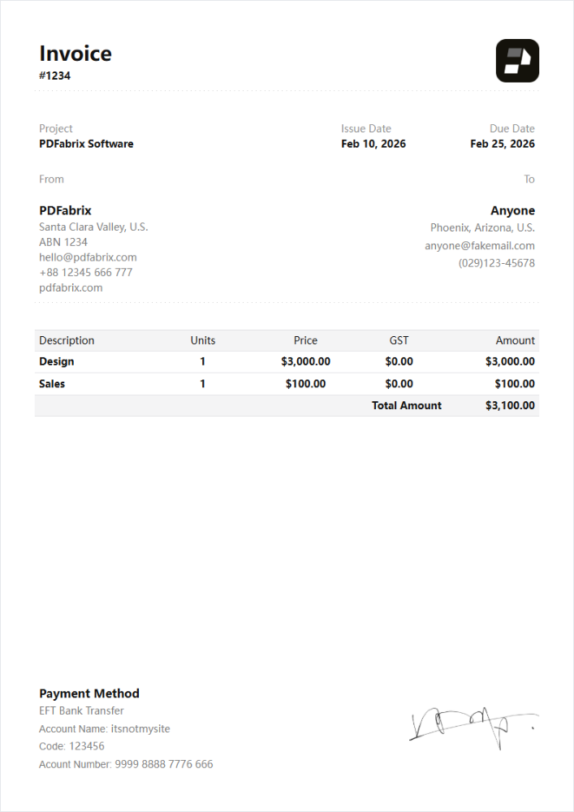
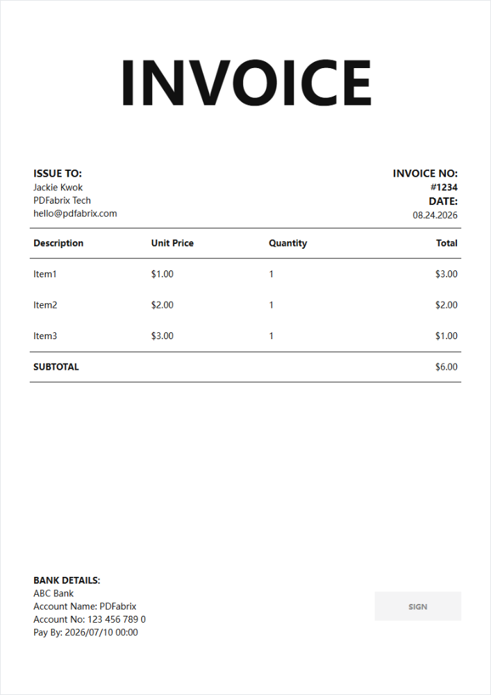
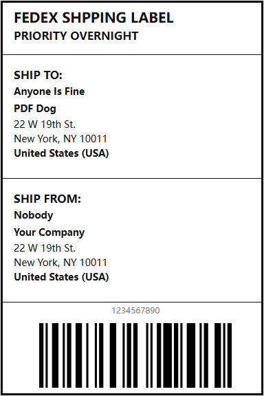

# PDFabrix

PDFabrix is a **desktop PDF automation tool** for batch processing, PDF generation, templates, and repetitive document workflows.

Instead of processing PDF files one by one, PDFabrix helps you process files in batches, generate documents from templates and data, and automate repetitive PDF workflows.

# 🎁 [Early Access: Get Pro features free for 90 days！ Check Here](https://pdfabrix.com/early-access)

### Why PDFabrix?

* ⚡ **Batch processing** — Process multiple PDF files at once.
* 🤖 **Automation** — Automate repetitive PDF workflows.
* 📄 **PDF generation** — Generate PDFs from reusable templates and data.
* 📋 **Templates** — Create reusable document templates for recurring tasks.
* ⏱️ **Save time** — Reduce manual operations and repetitive clicks.
* 🖥️ **Desktop-first** — Fast, lightweight, and designed for everyday workflows.
* 🔒 **Privacy-focused** — Files can be processed locally on your device.

## Use Cases

PDFabrix is useful for repetitive document workflows such as:

* Generate PDFs from Excel or CSV data
* Create invoices, certificates, reports, and forms from templates
* Batch process large numbers of PDF files
* Automate recurring PDF generation tasks
* Create reusable templates for recurring documents

## Download

🌐 **Website:** https://pdfabrix.com

💳 **Pricing:** https://pdfabrix.com/pricing

## Community

This repository is the official home of PDFabrix for:

* Bug reports
* Feature requests
* Workflow ideas
* Template sharing
* Product feedback
* Releases

Browse the templates in [`templates/`](https://github.com/PDFabrix/pdfabrix/tree/main/templates).

To contribute templates, see [`templates/README.md`](https://github.com/PDFabrix/pdfabrix/blob/main/templates/README.md).

## Gallery

<!-- gallery:start -->

<!-- Generated by npm run gallery. Do not edit manually. -->

3 templates

<table>
<tr><td align="center" valign="top" width="33%"><a href="./templates/invoice-2-a4/"> <strong>Invoice 2 A4</strong></a> <em>by PDFabrix</em></td>
<td align="center" valign="top" width="33%"><a href="./templates/invoice-simple-a4/"> <strong>Invoice Simple A4</strong></a> <em>by PDFabrix</em></td>
<td align="center" valign="top" width="33%"><a href="./templates/shpping-label/"> <strong>Shpping Label</strong></a> <em>by PDFabrix</em></td></tr>
</table>

<!-- gallery:end -->

## Links

- [PDFabrix](https://pdfabrix.com)
- [Contribution guide](./templates/README.md)
- [Issues](https://github.com/PDFabrix/pdfabrix/issues)
